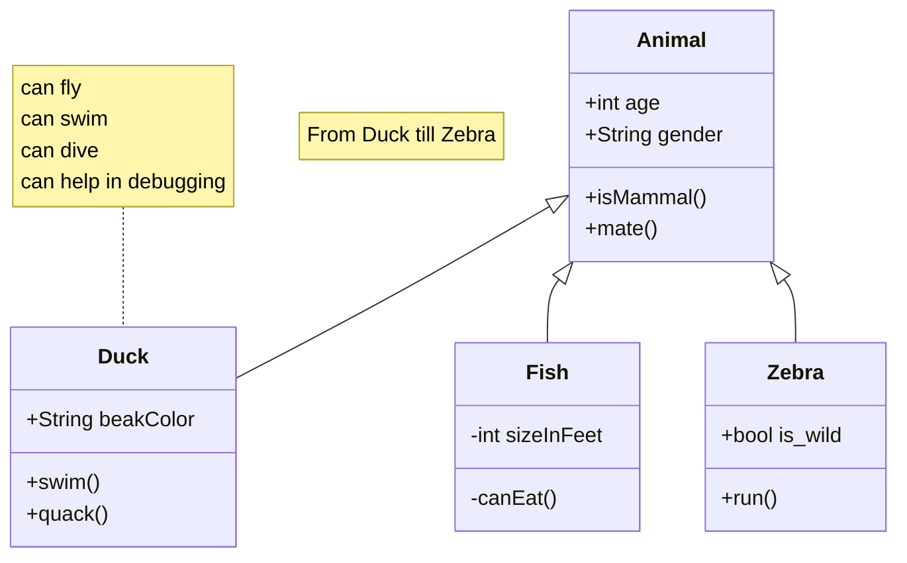

## Description

This unit describes the functionality of the module called into during a Psychopy trial.

### Public Interfaces

#### Interface

##### State Machine

## Unit Test Description

### Interface

#### Positive Tests

> [!test-card] "title"
>
>
> **Inputs:**
>
> **Expected Output:**
>

#### Negative Tests

> [!test-card] "Computation not executed"
>
>
> **Inputs:**
>
>
> **Expected Output:**
>
